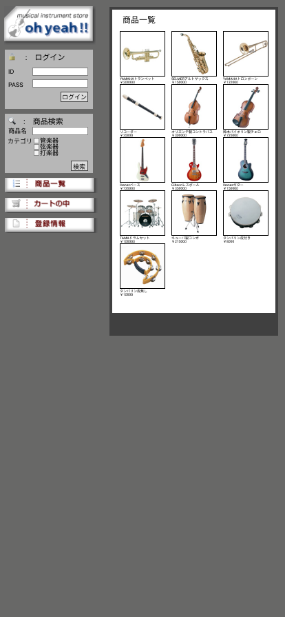

### 画像詳細図
## トップページ
### プロトタイプは以下のリンク先
[プロトタイプ]()
*****

*****
補足：対応DBの列はDB設計後、〇を対応する・カラム名に差し替えること。

| ID | 要素 | 内容 | アクション | イベント | 対応DB　|
|----|------|-----|-----------|----------|--------|
|1   |バナー |サイト名表示|-    |-         |-       |
|2   |ログイン|テキスト表示|-   |-         |-       |
|3   |ID    |入力欄 |テキスト入力|-        |〇      |
|4   |PASS  |入力欄|テキスト入力|-         |〇      |
|5   |ログインボタン|ボタン|クリック|ログイン処理実行|-|
|6   |商品検索|テキスト画像|-    |-        |-       |
|7   |商品名 |テキスト表示|-    |-        |-        |
|8   |商品名 |入力欄||||
|9   |カテゴリ|||||
|10  |管楽器 |||||
|11  |管楽器 |||||
|12  |弦楽器 |||||
|13  |弦楽器 |||||
|14  |打楽器 |||||
|15  |打楽器 |||||
|16  |検索   |||||
|17  |商品一覧|||||
|18  |カートの中|||||
|19  |登録情報|||||
|20  |商品一覧|||||
|21  |商品画像|||||
|22  |商品名 |||||
|23  |価格   |||||
